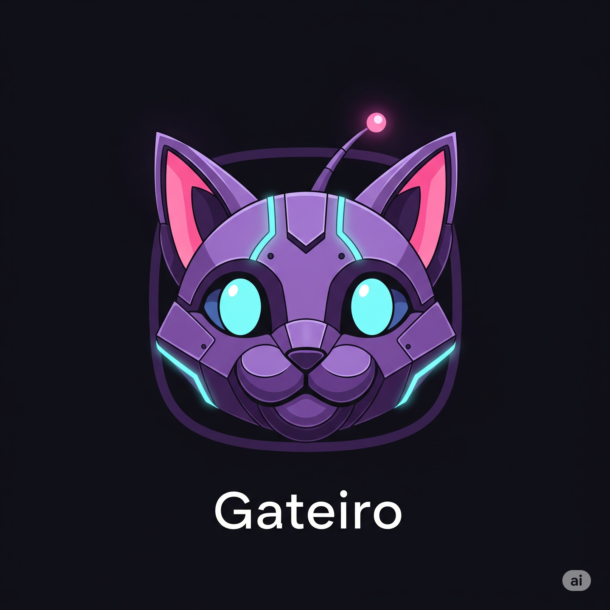

# Gateiro


Bem-vindo ao **Gateiro**! Este é um sistema simples para gerenciar gatos disponíveis para adoção, desenvolvido como trabalho prático para a disciplina de  Desenvolvimento Web do curso técnico de  Informática para Internet no IFC. 

 
## Funcionalidades

Este projeto permite aos usuários:

* **Cadastrar** novos gatos com informações detalhadas.
* **Listar** todos os gatos disponíveis para adoção.
* **Editar** os dados de um gato já cadastrado.
* **Excluir** um gato da lista de adoção.

## Tecnologias Utilizadas

O projeto foi construído utilizando as seguintes tecnologias, todas rodando em contêineres Docker:

* **PHP**: Linguagem de programação principal para o backend.
* **Tailwind CSS (via CDN)**: Framework de CSS para estilização rápida e responsiva.
* **MongoDB**: Banco de dados NoSQL para persistir os dados dos gatos.
* **Docker e Docker Compose**: Ferramentas para orquestração e gerenciamento do ambiente de desenvolvimento.

## Demonstração

Veja abaixo uma captura de tela do sistema em funcionamento:


## Como Rodar o Projeto no Linux

Siga estes passos para configurar e executar o projeto na sua máquina local:

1.  **Pré-requisitos**: Certifique-se de ter o Docker e o Docker Compose instalados.
2.  **Clone o repositório**:
    ```bash
    git clone [https://github.com/Biahjwff/Gateiro.git](https://github.com/Biahjwff/Gateiro.git)
    cd seu-repositorio
    ```
3.  **Inicie o ambiente**: Use o ./start.sh para subir todos os serviços e rodar o projeto localmente (PHP, MongoDB, etc.).
    ```bash
    ./start.sh
    ```
4.  **Acesse o sistema**: Abra seu navegador e navegue para `http://localhost:800`.

## Contribuição

Contribuições são sempre bem-vindas! Se você encontrar um bug ou tiver uma sugestão de melhoria, sinta-se à vontade para abrir uma *issue* ou enviar um *pull request*.

## Autor

**Bianca Jussara Wolff** - (https://github.com/Biahjwff)
*Estudante de Informática para Internet no IFC.*
